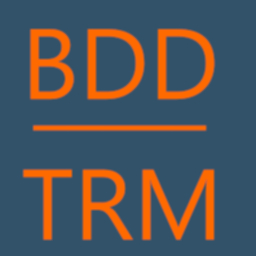

# BDD_TRM
## Application for Translating E/R Model to Relational Model

This API allows you to convert an Entity-Relationship (E/R) model of a database into a Relational model. The tool automates the process of transitioning from a conceptual design to an actual relational schema.

## How to Use

To use this API, follow these steps:

1. **Initialize Entities:**
   Create an `Entities` object to store the names of your entities and their respective fields.

2. **Initialize Relationships:**
   Create a `Relationships` object to define all the relationships between entities. Include the relationship names, fields, cardinalities, and the names of the involved entities.

3. **Translate the E/R Model:**
   Create a `Plan` object and use the `.translate()` method to convert the E/R model into a relational schema.

## Structure Overview

### Link Structure

The `Link` structure models the connection between an association and two entities. It takes two booleans and two strings as parameters:

    - The booleans represent the cardinalities of the relationship:

        - `true` indicates a **one-to-many (1:N)** relationship.

        - `false` indicates a **one-to-one (1:1)** relationship.

    - The two strings represent the names of the entities involved in the relationship.

### Entities Structure

The `Entities` structure models the list of concepts from the model E/R. It takes an `HashMap` where:

   - The keys are `String` object and model the **names**.

   - The values are `Vec<String>` object and model the **fields**.

## Examples 

You can consult the tests for some examples of operation :

https://github.com/LugolBis/BDD_Model/blob/main/tests/test_integration.rs

## Special Notes

For one-to-one relationships between two distinct entities, the new fields resulting from the relationship are added to the second entity in the relationship (as represented by the second string in the `Link` structure).
